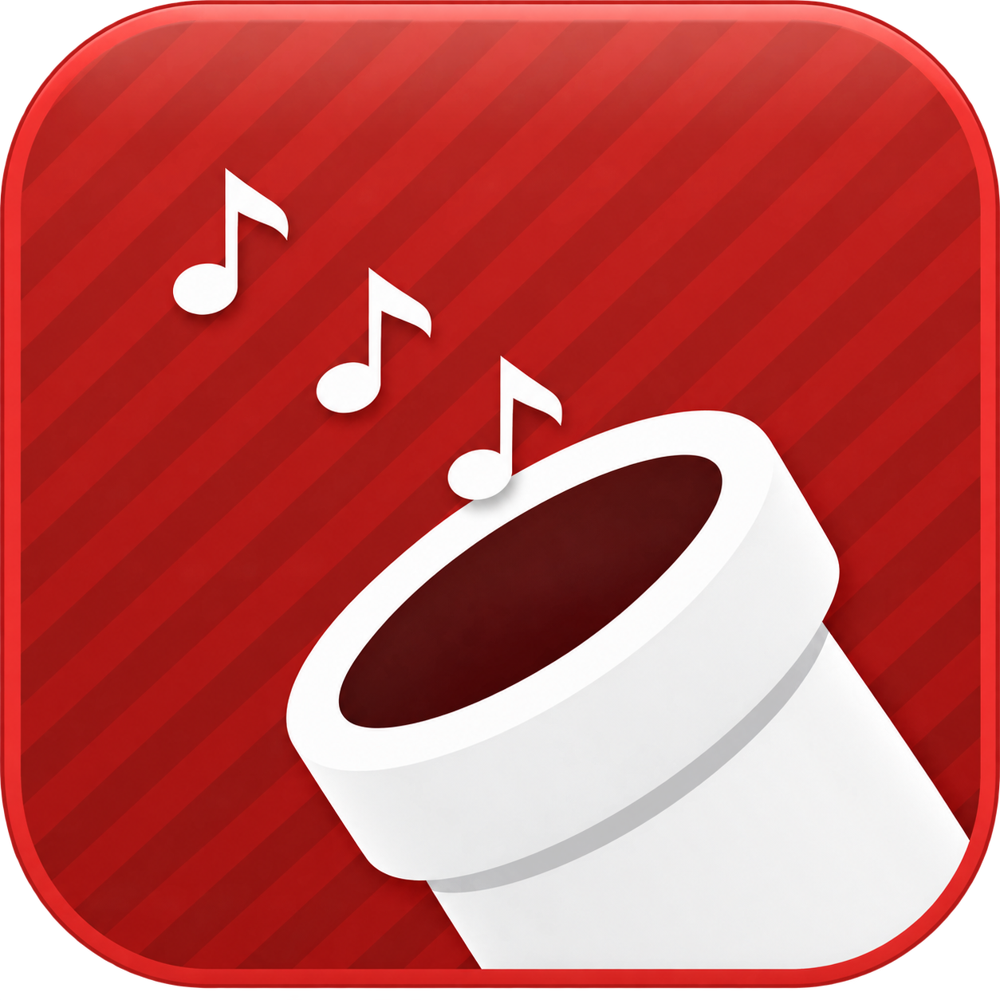
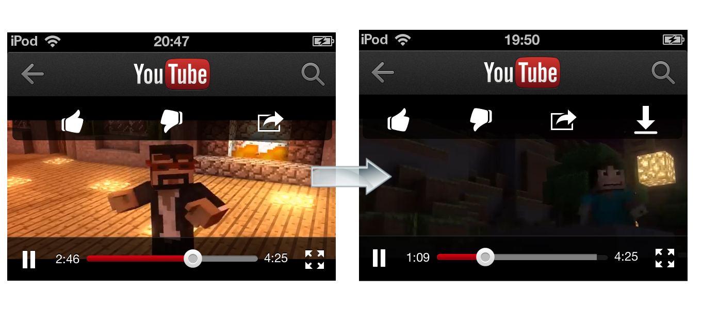

  

# TubePod

TubePod turns your legacy iOS device into a capable offline music player by adding a quick way to save YouTube audio directly to the Music library.

## What you need

- A jailbroken armv7 device running iOS 6.0–6.1.6
- MobileSubstrate
- YouTube 1.4.0 (support for other versions may come later), available through [Veteris](https://github.com/victorlobe/Veteris) or find an IPA
- [TubeReplacer](https://github.com/Preloading/TubeReplacer) to make the classic YouTube app work again

Veteris requires AppSync Unified.

## Setup

1. Install YouTube 1.4.0.
2. Install TubeReplacer.
3. Add `http://cydia.pruefsumme.xyz` to Cydia and install TubePod.

## How it works

Open a video and tap the white download arrow beside Like, Dislike, and Share. Keep YouTube open while the file downloads, then stay in Music until TubePod says it was saved. **Save Audio** in the Share menu is available as a fallback.

  

Only download audio you own or have permission to save.

## Development

Building requires Theos and the official iOS 6.1 SDK from Xcode 4.6.3. Device findings are kept in [docs/technical-notes.md](docs/technical-notes.md).

## License

TubePod is licensed under GPL-3.0. See [LICENSE](LICENSE).
